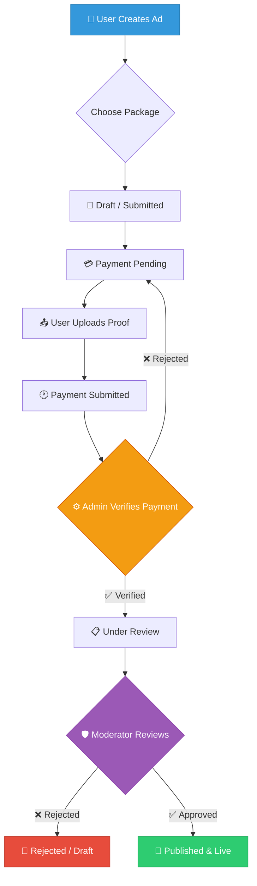

<div align="center">

<h1>⚡ Adflow Pro</h1>

<p><strong>A Full-Stack Digital Marketplace & Classified Advertising Platform</strong></p>

<p>
  
  
  
  
  
  
  
  
</p>

<p>
  <a href="https://adflowpro-kappa.vercel.app/" target="_blank"><strong>🌐 Live Demo</strong></a> &nbsp;·&nbsp;
  <a href="https://github.com/fa23-bcs-010-eng/Adflow/raw/main/Adflow.apk"><strong>📱 Download APK</strong></a> &nbsp;·&nbsp;
  <a href="#-getting-started"><strong>🚀 Quick Start</strong></a>
</p>

</div>

---

## 📌 Table of Contents

- [Overview](#-overview)
- [Live Demo & Credentials](#-live-demo--credentials)
- [Core Workflow](#-core-workflow--ad-lifecycle)
- [Key Features](#-key-features)
- [Subscription Packages](#-subscription-packages)
- [Technology Stack](#️-technology-stack)
- [Project Structure](#-project-structure)
- [Architecture & RBAC](#️-architecture--role-based-access-control)
- [Database Setup](#️-database-setup)
- [Environment Variables](#️-environment-variables)
- [Getting Started](#-getting-started)
- [Deployment](#-deployment)
- [API Reference](#-api-reference)
- [Author](#-author)

---

## 📖 Overview

**Adflow Pro** is a production-ready, full-stack classified advertising and digital marketplace platform. It enables users to browse, post, and manage ads with an end-to-end workflow covering payment verification, content moderation, and order fulfillment.

The platform is built with a **monorepo architecture**, separating a **Next.js 16 / React 19** frontend from a **Node.js / Express.js** backend, both powered by **Supabase (PostgreSQL)** as the primary database. An integrated **Python FastAPI** microservice provides AI-powered assistant capabilities via **Google Gemini 2.5 Flash** through the **Google ADK**.

### What makes Adflow Pro stand out:
- 🔄 **Full Ad Lifecycle** — from draft to live, with manual payment verification and content moderation gates
- 🤖 **Built-in AI Assistant** — floating chat widget backed by a Google ADK agent with Gemini fallback
- 🛡️ **Enterprise RBAC** — four role tiers: Client, Moderator, Admin, Super Admin
- 📦 **4-Tier Subscription Model** — Free through Enterprise with feature gating
- 🏪 **Marketplace Checkout** — buyers can cart and purchase ads; sellers track incoming orders
- 📊 **Multi-phase DB Schema** — modular SQL migrations for Marketplace, Business Growth, and Pro features
- 📱 **Android APK** — mobile build available for direct download

---

## 🌐 Live Demo & Credentials

**Live Platform:** [https://adflowpro-kappa.vercel.app/](https://adflowpro-kappa.vercel.app/)

Use the following demo accounts to explore each portal:

| Role | Email | Password |
| :--- | :--- | :--- |
| 👤 Client | `client_demo@adflow.com` | `demo123` |
| 🛡️ Moderator | `moderator_demo@adflow.com` | `demo123` |
| ⚙️ Admin | `admin_demo@adflow.com` | `demo123` |
| 👑 Super Admin | `super_admin_demo@adflow.com` | `demo123` |

---

## 🔄 Core Workflow — Ad Lifecycle



---

## ✨ Key Features

### 🛍️ Client & Marketplace Experience
| Feature | Description |
| :--- | :--- |
| **Smart Ad Discovery** | Browse, filter, and search ads by category, city, and keyword |
| **Buy & Sell Flow** | Buyers can view ad details, add to cart, and place orders |
| **Dynamic Checkout** | Tab-based payment gateway (Credit/Debit, Bank Transfer, Mobile Wallet) |
| **Order Tracking** | Sellers track incoming orders; buyers follow order status history |
| **Premium Packages** | Upgrade ad visibility with Standard, Premium, or Enterprise plans |
| **Client Dashboard** | Manage profile, listings, payments, orders, and notifications |
| **3D Product Viewer** | Interactive `.glb`/`.gltf` model viewer on supported product listings |
| **JWT Auth** | Secure sign-up and login tightly integrated with Supabase |

### 🛡️ Moderation & Administration
| Feature | Description |
| :--- | :--- |
| **Moderator Portal** | Dedicated feed to review, approve, or reject submitted ads |
| **Admin Dashboard** | Platform analytics, revenue tracking, and payment verification |
| **User Role Management** | Super Admin can assign and modify user roles |
| **Fraud Scoring** | AI-based risk assessment on ad submissions (Phase 3) |
| **Cron Jobs** | Auto-expire old ads, manage subscriptions, and system cleanup |

### 🤖 AI Assistant (Adflow AI Mode)
| Feature | Description |
| :--- | :--- |
| **Floating Widget** | Accessible from any page without leaving context |
| **Contextual Guidance** | Helps with ad posting, packages, dashboard navigation |
| **ADK Agent** | Powered by `gemini-2.5-flash` via Google Agent Development Kit |
| **Dual Backend** | Tries `AI_BACKEND_URL` first; falls back to direct Gemini API |
| **Clean Responses** | Strips markdown, removes time-helper boilerplate |
| **Session Persistence** | In-memory session management per user UUID |

#### AI Request Flow
```
User Message
    → POST /api/ai/chat  (Next.js API Route)
        → AI_BACKEND_URL/chat  (Python FastAPI + ADK)
            ↔ Gemini 2.5 Flash
        → Fallback: Direct Gemini API (GOOGLE_API_KEY)
    ← Normalized plain-text reply
```

### 📈 Phase 2 — Business Growth Features
- Seller reviews after delivery
- Ad reports and complaint moderation
- Listing promotions & ad boosting
- Analytics events (views, cart adds, purchases, chat opens)
- SEO marketplace pages

### 🔒 Phase 3 — Pro Marketplace Features
- Escrow hold & release for order funds
- Logistics shipment tracking
- AI pricing guidance per ad submission
- AI auto-moderation assessments

---

## 📦 Subscription Packages

| Feature | **Basic** 🆓 | **Standard** 💼 | **Premium** ⭐ | **Enterprise** 🏢 |
| :--- | :---: | :---: | :---: | :---: |
| **Price** | Free | PKR 49 | PKR 99 | PKR 299 |
| **Duration** | 7 days | 30 days | 90 days | 365 days |
| **Listings** | Up to 5 | Unlimited | Unlimited | Unlimited |
| **Support** | Basic | Email | Priority | 24/7 Dedicated |
| **Analytics** | — | Basic | Advanced | Custom |
| **Featured Badge** | — | — | ✅ | ✅ |
| **Bulk Upload** | — | — | ✅ (50 ads) | ✅ |
| **Team Management** | — | — | — | ✅ (10 members) |
| **API Access** | — | — | — | ✅ |
| **Custom Workflows** | — | — | — | ✅ |

---

## 🛠️ Technology Stack

### Frontend — `client/`
| Technology | Version | Role |
| :--- | :--- | :--- |
| **Next.js** | 16.2.1 | Framework (App Router) |
| **React** | 19.2.4 | UI Library |
| **TypeScript** | ^5 | Static Typing |
| **Tailwind CSS** | ^4 | Utility-first Styling |
| **Supabase JS** | ^2.100 | Auth & Realtime |
| **Axios** | ^1.13 | HTTP Client |
| **Lucide React** | ^1.7 | Icon System |
| **React Hot Toast** | ^2.6 | Notifications |
| **Zod** | ^3.22 | Schema Validation |

### Backend — `server/`
| Technology | Version | Role |
| :--- | :--- | :--- |
| **Node.js + Express** | ^4.18 | REST API Server |
| **Supabase JS** | ^2.39 | PostgreSQL ORM |
| **JWT** | ^9 | Auth Tokens |
| **bcryptjs** | ^2.4 | Password Hashing |
| **Helmet** | ^7 | HTTP Security Headers |
| **Morgan** | ^1.10 | Request Logging |
| **node-cron** | ^3 | Task Scheduling |
| **Zod** | ^3.22 | Request Validation |
| **Slugify** | ^1.6 | SEO URL Slugs |
| **Nodemon** | ^3.1 | Dev Hot-reload |

### AI Backend — `backend_api.py`
| Technology | Version | Role |
| :--- | :--- | :--- |
| **Python** | 3.10+ | Runtime |
| **FastAPI** | ^0.115 | API Framework |
| **Uvicorn** | ^0.30 | ASGI Server |
| **Google ADK** | ^1.0 | Agent Framework |
| **Gemini 2.5 Flash** | — | LLM |
| **python-dotenv** | ^1.0 | Env Management |

### Infrastructure
| Service | Purpose |
| :--- | :--- |
| **Vercel** | Frontend & API hosting |
| **Supabase** | PostgreSQL + Auth |
| **Railway / Render** | Python AI backend |
| **GitHub** | Version control |

---

## 📂 Project Structure

```text
📦 Adflow Pro (Monorepo)
│
├── 📁 client/                        # Next.js 16 Application (TypeScript)
│   ├── 📁 src/
│   │   ├── 📁 app/                   # App Router pages
│   │   │   ├── 📁 ads/[slug]/        # Dynamic ad detail page
│   │   │   ├── 📁 auth/              # Login & registration
│   │   │   ├── 📁 categories/        # Category browsing
│   │   │   ├── 📁 checkout/          # Order checkout flow
│   │   │   ├── 📁 cities/            # City-filtered listings
│   │   │   ├── 📁 contact/           # Contact page
│   │   │   ├── 📁 dashboard/
│   │   │   │   ├── 📁 admin/         # Admin portal
│   │   │   │   ├── 📁 client/        # Seller/buyer dashboard
│   │   │   │   │   ├── 📁 notifications/
│   │   │   │   │   └── 📁 pay/       # Payment upload
│   │   │   │   └── 📁 moderator/     # Moderator review feed
│   │   │   ├── 📁 explore/           # Search & filtering
│   │   │   ├── 📁 faq/               # Help centre
│   │   │   ├── 📁 marketplace/       # Marketplace hub
│   │   │   ├── 📁 packages/          # Subscription plans
│   │   │   ├── 📁 privacy/           # Privacy policy
│   │   │   ├── 📁 terms/             # Terms of service
│   │   │   └── 📁 api/               # Next.js API routes (AI proxy)
│   │   ├── 📁 components/            # Shared UI components
│   │   │   ├── AdCard.tsx
│   │   │   ├── AiModeWidget.tsx
│   │   │   ├── Footer.tsx
│   │   │   ├── Navbar.tsx
│   │   │   ├── Providers.tsx
│   │   │   └── StatusBadge.tsx
│   │   ├── 📁 lib/                   # Utilities & Supabase client
│   │   └── 📁 types/                 # TypeScript type definitions
│   ├── next.config.ts
│   └── .env.local.example
│
├── 📁 server/                        # Express.js REST API
│   ├── 📁 src/
│   │   ├── 📁 config/                # Supabase & env config
│   │   ├── 📁 cron/                  # Scheduled background tasks
│   │   ├── 📁 middleware/            # Auth & RBAC middleware
│   │   ├── 📁 routes/                # Route handlers
│   │   │   ├── admin.routes.js
│   │   │   ├── auth.routes.js
│   │   │   ├── client.routes.js
│   │   │   ├── moderator.routes.js
│   │   │   ├── public.routes.js
│   │   │   ├── internal.routes.js
│   │   │   ├── cron.routes.js
│   │   │   └── questions.routes.js
│   │   ├── 📁 services/              # Business logic layer
│   │   └── 📁 validators/            # Zod request schemas
│   └── package.json
│
├── 📁 db/                            # SQL Schemas & Migrations
│   ├── schema.sql                    # Core tables
│   ├── seed.sql                      # Initial seed data
│   ├── orders_migration.sql          # Phase 1: Marketplace orders
│   ├── phase1_marketplace_migration.sql
│   ├── phase2_business_growth.sql    # Phase 2: Reviews, analytics
│   ├── phase3_pro_marketplace.sql    # Phase 3: Escrow, AI scoring
│   └── buyer_seller_accounts.sql
│
├── 📁 my_agent/                      # Google ADK AI Agent
│   └── agent.py                      # Gemini 2.5 Flash agent definition
│
├── 📁 web/                           # Static web UI for AI backend
│   ├── index.html
│   ├── app.js
│   └── styles.css
│
├── 📁 docs/                          # Documentation assets
├── backend_api.py                    # FastAPI AI microservice (Python)
├── requirements.txt                  # Python dependencies
├── vercel.json                       # Vercel deployment config
├── package.json                      # Monorepo root scripts
└── Adflow.apk                        # Android APK build
```

---

## 🏗️ Architecture & Role-Based Access Control

### RBAC — Four Permission Tiers

| Role | Capabilities |
| :--- | :--- |
| **`client`** | Browse, post ads, upload payment proof, manage profile, place orders |
| **`moderator`** | Approve / reject ads, view moderation feed |
| **`admin`** | Verify payments, manage users, view platform analytics |
| **`super_admin`** | All admin capabilities + role assignment + system overrides |

All role checks are enforced via **Express middleware** on every protected route. The frontend conditionally renders dashboards based on the JWT-decoded role.

### Database Architecture

```
Supabase (PostgreSQL) — Primary
    ├── users / profiles
    ├── ads + ad_media
    ├── categories / cities
    ├── packages / payments
    ├── orders / order_items / order_status_history
    ├── seller_reviews / ad_reports / ad_promotions
    ├── ad_analytics_events
    ├── escrow_transactions
    └── logistics_shipments / ad_ai_assessments
```

---

## 🗄️ Database Setup

Run SQL migrations in the following order from your Supabase SQL Editor:

### Step 1 — Core Schema
```bash
db/schema.sql          # Users, ads, categories, cities, packages, payments
db/seed.sql            # Initial lookup data
```

### Step 2 — Marketplace Orders *(Phase 1)*
```bash
db/orders_migration.sql
# Creates: orders, order_items, order_status_history
```

### Step 3 — Business Growth *(Phase 2)*
```bash
db/phase2_business_growth.sql
# Creates: seller_reviews, ad_reports, ad_promotions, ad_analytics_events
```

### Step 4 — Pro Marketplace *(Phase 3)*
```bash
db/phase3_pro_marketplace.sql
# Creates: escrow_transactions, logistics_shipments, ad_ai_assessments
```

---

## ⚙️ Environment Variables

### Root / Server `.env`

| Variable | Required | Description |
| :--- | :---: | :--- |
| `SUPABASE_URL` | ✅ | Supabase project URL |
| `SUPABASE_ANON_KEY` | ✅ | Supabase public API key |
| `SUPABASE_SERVICE_ROLE_KEY` | ✅ | Supabase service role key (secret) |
| `JWT_SECRET` | ✅ | Secret for signing JWTs |
| `JWT_EXPIRES_IN` | ✅ | Token expiry (e.g. `7d`) |
| `PORT` | — | Express port (default: `4000`) |
| `NODE_ENV` | — | `development` or `production` |
| `AI_BACKEND_URL` | — | URL of deployed Python AI service |
| `GOOGLE_API_KEY` | — | Gemini API key (AI fallback) |
| `GEMINI_API_KEY` | — | Alias for `GOOGLE_API_KEY` |
| `NEXT_PUBLIC_API_URL` | ✅ | Backend URL for client requests |

### Client `.env.local`

| Variable | Required | Description |
| :--- | :---: | :--- |
| `NEXT_PUBLIC_API_URL` | ✅ | Backend URL (e.g. `http://localhost:4000`) |
| `NEXT_PUBLIC_SUPABASE_URL` | ✅ | Same as `SUPABASE_URL` |
| `NEXT_PUBLIC_SUPABASE_ANON_KEY` | ✅ | Same as `SUPABASE_ANON_KEY` |
| `NEXT_PUBLIC_CHATBOT_URL` | — | Optional external chatbot URL |

### Python AI Backend `my_agent/.env`

| Variable | Required | Description |
| :--- | :---: | :--- |
| `GOOGLE_API_KEY` | ✅ | Gemini API key for ADK agent |

> Copy `.env.example` and `client/.env.local.example` to get started quickly.

---

## 🚀 Getting Started

### Prerequisites
- **Node.js** v18+
- **Python** 3.10+ *(for AI backend)*
- A **Supabase** project

### 1. Clone & Install

```bash
git clone https://github.com/fa23-bcs-010-eng/Adflow.git
cd Adflow
npm run install:all
```

### 2. Configure Environment

```bash
# Server environment
cp .env.example .env
# Fill in SUPABASE_URL, SUPABASE_ANON_KEY, SUPABASE_SERVICE_ROLE_KEY, JWT_SECRET

# Client environment
cp client/.env.local.example client/.env.local
# Fill in NEXT_PUBLIC_API_URL, NEXT_PUBLIC_SUPABASE_URL, NEXT_PUBLIC_SUPABASE_ANON_KEY
```

### 3. Run Database Migrations

Execute `db/schema.sql` and `db/seed.sql` in your **Supabase SQL Editor**, then optionally run Phase 1–3 migrations.

### 4. Start Development Servers

```bash
# Starts both client (port 3000) and server (port 4000) concurrently
npm run dev
```

| Service | URL |
| :--- | :--- |
| **Frontend** | `http://localhost:3000` |
| **Backend API** | `http://localhost:4000` |

### 5. (Optional) Run AI Backend

```bash
pip install -r requirements.txt
uvicorn backend_api:app --reload --port 8000
```

### 6. Verify Health

```bash
curl http://localhost:4000/api/health
```

```json
{ "status": "ok" }
```

---

## 🌍 Deployment

### Vercel (Frontend + API)

| Setting | Value |
| :--- | :--- |
| **Framework** | Next.js (auto-detected) |
| **Build Command** | `npm run build` |
| **Install Command** | `npm run install:all` |
| **Output Directory** | `.next` |

**Required environment variables in Vercel Dashboard:**

```env
SUPABASE_URL=
SUPABASE_ANON_KEY=
SUPABASE_SERVICE_ROLE_KEY=
JWT_SECRET=
JWT_EXPIRES_IN=7d
NEXT_PUBLIC_API_URL=https://your-deployment.vercel.app
NEXT_PUBLIC_SUPABASE_URL=
NEXT_PUBLIC_SUPABASE_ANON_KEY=
AI_BACKEND_URL=https://your-ai-backend.up.railway.app
GOOGLE_API_KEY=
```

### Railway / Render (Python AI Backend)

Deploy the following files:
```
backend_api.py
requirements.txt
my_agent/
web/
```

**Start command:**
```bash
uvicorn backend_api:app --host 0.0.0.0 --port $PORT
```

**Required environment variable:**
```env
GOOGLE_API_KEY=your_gemini_key
```

### Post-Deployment Checklist
- [ ] Verify API health: `https://your-app.vercel.app/api/health`
- [ ] Verify AI backend: `https://your-ai.railway.app/health`
- [ ] Run Phase 1–3 SQL migrations in Supabase
- [ ] Test login with demo credentials

---

## 📡 API Reference

### Auth Routes — `/api/auth`
| Method | Endpoint | Description |
| :--- | :--- | :--- |
| `POST` | `/api/auth/register` | Create new account |
| `POST` | `/api/auth/login` | Login and receive JWT |

### Public Routes — `/api/public`
| Method | Endpoint | Description |
| :--- | :--- | :--- |
| `GET` | `/api/public/ads` | List all active ads |
| `GET` | `/api/public/ads/:slug` | Single ad detail |
| `GET` | `/api/public/categories` | All categories |
| `GET` | `/api/public/cities` | All cities |
| `GET` | `/api/public/packages` | Subscription packages |

### Client Routes — `/api/client` *(JWT required)*
| Method | Endpoint | Description |
| :--- | :--- | :--- |
| `GET/POST` | `/api/client/ads` | Manage own ads |
| `POST` | `/api/client/payments` | Upload payment proof |
| `GET` | `/api/client/orders` | View orders |
| `GET` | `/api/client/notifications` | Notifications |

### Moderator Routes — `/api/moderator` *(Moderator role)*
| Method | Endpoint | Description |
| :--- | :--- | :--- |
| `GET` | `/api/moderator/ads` | Pending review queue |
| `PATCH` | `/api/moderator/ads/:id` | Approve or reject ad |

### Admin Routes — `/api/admin` *(Admin role)*
| Method | Endpoint | Description |
| :--- | :--- | :--- |
| `GET` | `/api/admin/payments` | All pending payments |
| `PATCH` | `/api/admin/payments/:id` | Verify or reject payment |
| `GET` | `/api/admin/users` | User management |
| `GET` | `/api/admin/analytics` | Platform metrics |

### System Routes
| Method | Endpoint | Description |
| :--- | :--- | :--- |
| `GET` | `/api/health` | Full system health check |
| `GET` | `/api/internal/db/stats` | DB collection statistics |
| `POST` | `/api/ai/chat` | AI assistant chat (proxied) |

---

## 📸 Screenshots

| Home / Explore | Client Dashboard | Package Selection |
| :---: | :---: | :---: |
|  |  |  |

| Dynamic Checkout | Admin Analytics | Moderator Feed |
| :---: | :---: | :---: |
|  |  |  |

---

## 🤝 Contributing

1. Fork the repository
2. Create a feature branch: `git checkout -b feature/your-feature`
3. Commit changes: `git commit -m "feat: add your feature"`
4. Push to branch: `git push origin feature/your-feature`
5. Open a Pull Request

---

## 📄 License

This project is licensed under the **MIT License**.

---

## 👤 Author

<div align="center">

**Hammad Raheel Sarwar**

*Full-Stack Developer & Software Engineering Student (Semester 6)*

[](https://github.com/fa23-bcs-010-eng)

*Built with scalability, rich aesthetics, and robust MVC software patterns in mind.*

</div>
