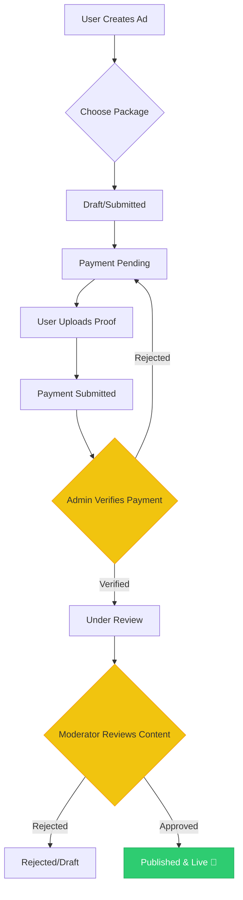
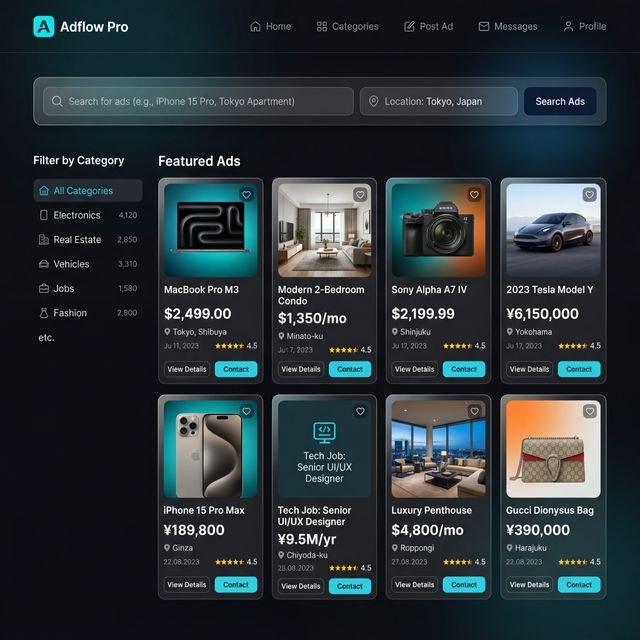
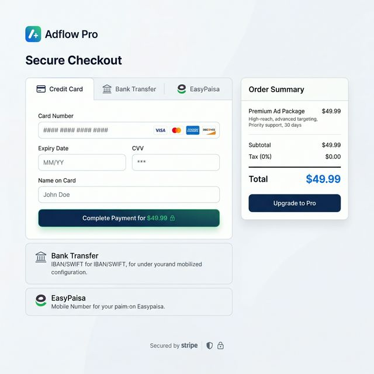
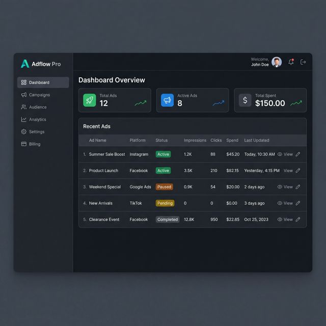
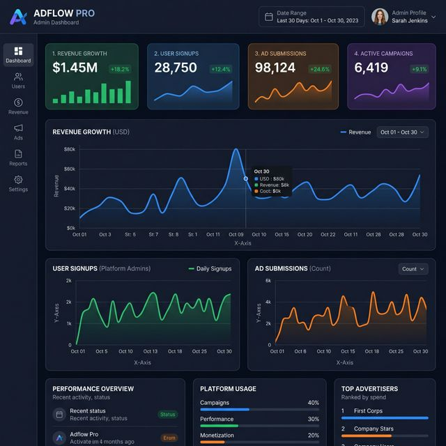
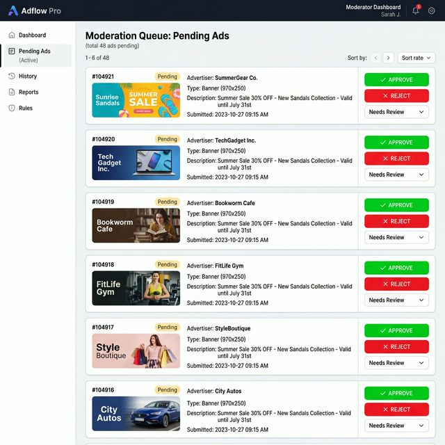
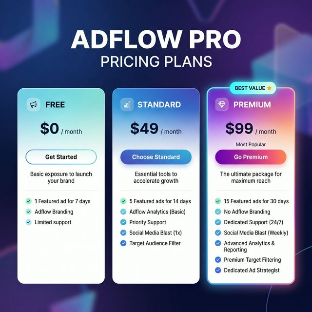

<div align="center">
  <h1>🚀 Adflow Pro</h1>
  <p><strong>A Comprehensive Full-Stack Digital Marketplace & Advertising Platform</strong></p>
  
  <p>
    
    
    
    
    
  </p>
</div>

## Live Demo

Check live project: [https://adflowpro-kappa.vercel.app/](https://adflowpro-kappa.vercel.app/)

### APK Download

Download Android app: [Adflow.apk](./Adflow.apk)

### Demo Logins

Use these demo credentials on the login page:

| Role | Demo Gmail | Demo Password |
| :--- | :--- | :--- |
| Client | `client_demo@adflow.com` | `demo123` |
| Moderator | `moderator_demo@adflow.com` | `demo123` |
| Admin | `admin_demo@adflow.com` | `demo123` |
| Super Admin | `super_admin_demo@adflow.com` | `demo123` |

---

## 📖 Overview

**Adflow Pro** is a modern, responsive, and robust digital marketplace where users can browse, post, and manage classified ads. The platform features an advanced **Product Requirements Document (PRD) compliant** payment and checkout system, dynamic package selections, and highly segregated dashboards tailored for **Clients**, **Moderators**, and **Admins**. 

This system was designed with scale, performance, and best engineering practices in mind, utilizing a Next.js App Router frontend and an Express.js/Node backend.

---

## 🔄 Core Workflow: Ad Lifecycle

The diagram below illustrates the comprehensive journey of an advertisement from initial creation to publication, including the manual payment verification and moderation steps.



---

## ✨ Key Features

### 🛍️ Client & User Experience
- **Smart Ad Discovery**: Browse, filter, and search for ads categorized by specific niches and cities.
- **Dynamic Checkout Flow**: Tab-based payment gateway supporting multiple methodologies (Credit/Debit, Bank transfer, Mobile Wallet).
- **Premium Packages**: Users can upgrade their ad visibility by purchasing standardized or premium packages.
- **Client Dashboard**: Manage profiles, view ad metrics, track payments, and follow up on submitted ad statuses.
- **Secure Authentication**: JWT-based sign-up and login tightly integrated with Supabase.

### 🛡️ Moderation & Administration
- **Moderator Portal**: Dedicated feeds to review, approve, or reject user-submitted ads, keeping platform content quality strictly governed.
- **Super/Admin Dashboard**: High-level platform analytics, revenue tracking, user role management, and manual payment verifications.
- **Automated Cron Jobs**: Background tasks that automatically expire old ads, manage subscription states, and perform system cleanups.

### AI Assistant (Adflow AI Mode)
- **Floating AI Button**: Users can open AI Mode from any page and chat without leaving the current screen.
- **Adflow Guidance**: Helps users with ad posting, package selection, dashboard usage, and account flow.
- **Production-Safe Integration**: AI chat is routed through Next.js API (`/api/ai/chat`) instead of `localhost` iframe dependency.
- **Backend Options**: Works with a deployed Python ADK backend (`AI_BACKEND_URL`) or direct Gemini API fallback (`GOOGLE_API_KEY`).
- **Clean Response Formatting**: Removes markdown stars/bullets and avoids irrelevant time prompts for normal Adflow conversations.

#### AI Request Flow
1. User sends a message from the AI Mode panel.
2. Frontend calls `POST /api/ai/chat`.
3. Route tries `AI_BACKEND_URL/chat` first.
4. If unavailable, route tries Gemini direct with `gemini-2.5-flash`.
5. Response is normalized and returned to the widget.

---

## � Subscription Packages

Choose the perfect plan for your advertising needs:

| Feature | **Basic** 🆓 | **Standard** 💼 | **Premium** ⭐ | **Enterprise** 🏢 |
| :--- | :---: | :---: | :---: | :---: |
| **Price** | Free | PKR 49 | PKR 99 | PKR 299 |
| **Duration** | 7 days | 30 days | 90 days | 365 days |
| **Listings** | Up to 5 | Unlimited | Unlimited | Unlimited |
| **Support** | Basic | Email | Priority | 24/7 Dedicated |
| **Analytics** | — | Basic | Advanced | Custom |
| **Featured Badge** | — | — | ✅ | ✅ |
| **Bulk Upload** | — | — | ✅ | ✅ |
| **Team Management** | — | — | — | ✅ |
| **API Access** | — | — | — | ✅ |
| **Custom Workflows** | — | — | — | ✅ |
| **Best For** | Getting Started | Active Sellers | Professional Sellers | Large Businesses |

### Package Details

#### 🆓 **Basic - Free**
- Perfect for trying out AdFlow
- Publish up to 5 listings
- 7 days validity per listing
- Basic customer support
- Standard listing display

#### 💼 **Standard - PKR 49**
- For active online sellers
- Unlimited listings
- 30 days validity per listing
- Email support
- Basic analytics & performance tracking
- Priority listing placement

#### ⭐ **Premium - PKR 99**
- For professional sellers & businesses
- Unlimited listings
- 90 days validity per listing
- Priority email & chat support
- Advanced analytics & insights
- Featured badge on listings
- Bulk upload capability (up to 50 ads)
- Enhanced visibility in search results

#### 🏢 **Enterprise - PKR 299**
- For businesses & large operations
- Unlimited everything
- 365 days validity per listing
- 24/7 dedicated account manager
- Custom analytics & reporting
- API access for integrations
- Team management (up to 10 members)
- Custom workflows & automation
- White-label options available
- Priority onboarding & training

---

## �📸 Screenshots

> *Add your demonstration screenshots to the `/docs/` folder and replace the placeholders below.*

| Search & Explore | Dynamic Checkout | Client Dashboard |
| :---: | :---: | :---: |
|  |  |  |

| Admin Analytics | Ad Review (Moderator) | Package Selection |
| :---: | :---: | :---: |
|  |  |  |

---

## 🛠️ Technology Stack

### **Frontend (Client)**
- **Framework**: [Next.js](https://nextjs.org/) (App Router, React 19)
- **Styling**: Tailwind CSS & PostCSS
- **UI Components & Icons**: Lucide React, React Hot Toast
- **Data Fetching**: Axios & Supabase-js

### **Backend (Server)**
- **Runtime & Framework**: Node.js with Express.js
- **Databases**: 
  - [Supabase](https://supabase.com/) (PostgreSQL) - Primary relational database
  - [MongoDB](https://www.mongodb.com/) with [Mongoose](https://mongoosejs.com/) - Optional document store for flexible schema data
- **Security & Validation**: JWT, bcryptjs, Helmet, CORS, and Zod (Schema Validation)
- **Utilities**: morgan (API Logging), slugify, node-cron (Task Scheduling)

---

## ⚙️ Configuration & Environment

The application requires specific environment variables to bridge the frontend and backend with Supabase.

### Root `.env` (Server)
| Variable | Description |
| :--- | :--- |
| `SUPABASE_URL` | Your Supabase project URL |
| `SUPABASE_ANON_KEY` | Public API key for Supabase |
| `SUPABASE_SERVICE_ROLE_KEY` | **Secret** Service Role key for administrative DB access |
| `MONGODB_ENABLE` | Toggle MongoDB connection (`true` / `false`) - defaults to `true` |
| `MONGODB_URI` | MongoDB connection string (e.g., `mongodb://localhost:27017/adflow`) |
| `MONGODB_DB_NAME` | MongoDB database name (e.g., `adflow`) |
| `JWT_SECRET` | Secret key for signing JSON Web Tokens |
| `JWT_EXPIRES_IN` | JWT expiration time (e.g., `7d`) |
| `PORT` | Local port for Express server (default: `4000`) |
| `NODE_ENV` | Environment mode (`development` or `production`) |
| `NEXT_PUBLIC_API_URL` | The URL where the server is hosted (for client requests) |
| `AI_BACKEND_URL` | Public URL of deployed Python AI backend (e.g., Railway/Render URL) |
| `GOOGLE_API_KEY` | Gemini API key for AI fallback (server-side) |
| `GEMINI_API_KEY` | Optional alias for Gemini API key |

### Client `.env.local`
| Variable | Description |
| :--- | :--- |
| `NEXT_PUBLIC_API_URL` | Points to your backend (e.g., `http://localhost:4000`) |
| `NEXT_PUBLIC_SUPABASE_URL` | Same as Server URL |
| `NEXT_PUBLIC_SUPABASE_ANON_KEY` | Same as Server Anon Key |
| `NEXT_PUBLIC_CHATBOT_URL` | Optional chatbot URL reference (avoid localhost in production) |

---

## 🗄️ Architecture & Core Models

### Core Database Entities
- **Users**: User profiles mapping tightly to RBAC (`client`, `moderator`, `admin`, `super_admin`).
- **Ads**: The fundamental marketplace entities containing descriptions, pricing, approval states, and boost/featured flags.
- **Categories & Cities**: Independent lookup models for hierarchical categorization.
- **Packages & Payments**: Structures to handle premium capabilities and track verifiable payment proofs.

### 🔐 Role-Based Access Control (RBAC)
Implemented via strict Express middleware:
- **`client`**: Standard privileges (browse, post ads, pay).
- **`moderator`**: Content management privileges (approve/reject).
- **`admin` / `super_admin`**: Platform overrides, analytics, and role modifications.

---

## 📊 MongoDB Collections & Schema

Adflow Pro includes **13 comprehensive MongoDB collections** designed to complement Supabase with document-style flexibility:

### Pre-seeded Collections ✅
| Collection | Count | Purpose |
| :--- | :---: | :--- |
| **packages** | 4 | Subscription tiers (Basic, Standard, Premium, Enterprise) |
| **categories** | 8 | Listing categories (Electronics, Vehicles, Real Estate, Fashion, Furniture, Books, Services, Sports) |
| **cities** | 8 | Cities (Karachi, Lahore, Islamabad, Rawalpindi, Multan, Peshawar, Faisalabad, Quetta) |
| **learning_questions** | 10 | FAQ content for user help widget |

### Ready for Data
| Collection | Purpose |
| :--- | :--- |
| **users** | User accounts & authentication (mirrors Supabase for flexibility) |
| **seller_profiles** | Public seller metadata, ratings, verification status |
| **ads** | Main marketplace listings with status, dates, featured flags |
| **ad_media** | Images & videos attached to ads with validation status |
| **payments** | Payment proofs & verification workflow |
| **notifications** | User in-app alerts & messages |
| **audit_logs** | System activity tracking for compliance |
| **ad_status_history** | Ad workflow transitions & moderation history |
| **system_health_logs** | Database & service performance monitoring |

### Database Initialization
The server automatically:
- ✅ Creates all indexes for performance
- ✅ Seeds initial data (4 packages, 8 categories, 8 cities, 10 FAQ items)
- ✅ Tracks collection statistics
- ✅ Reports connection health

### Admin Endpoints for MongoDB
- `GET /api/internal/db/stats` - View collection document counts
- `GET /api/internal/db/info` - MongoDB server info (version, uptime, memory)
- `GET /api/health` - Full system health including Mongo status

**See [MONGODB_SCHEMA.md](./MONGODB_SCHEMA.md) & [MONGODB_QUICK_REFERENCE.md](./MONGODB_QUICK_REFERENCE.md) for detailed documentation.**

---

## 📂 Project Structure

```text
📦 Adflow Pro
├── 📁 client/                # Next.js Application
│   ├── 📁 src/app/           # App Router Layouts & Pages
│   │   ├── 📁 ads/           # Detail views
│   │   ├── 📁 auth/          # Authentication screens
│   │   ├── 📁 dashboard/     # Client, Admin, and Moderator dashboards
│   │   └── 📁 explore/       # Search and filtering
│   └── .env.local.example    # Frontend env template
│
├── 📁 server/                # Express.js Application
│   ├── 📁 src/
│   │   ├── 📁 config/        # Supabase & MongoDB configuration
│   │   ├── 📁 models/        # 13 Mongoose models for MongoDB ✨ NEW
│   │   ├── 📁 seeds/         # Database seeding scripts ✨ NEW
│   │   ├── 📁 cron/          # Scheduled Node tasks
│   │   ├── 📁 middleware/    # Auth & RBAC logic
│   │   ├── 📁 routes/        # API Routers
│   │   ├── 📁 services/      # Abstraction for business logic
│   │   └── 📁 validators/    # Zod payload schemas
│   └── package.json          
│
├── 📁 db/                    # SQL Database Schemas and Migrations
├── 📄 MONGODB_SCHEMA.md      # Detailed MongoDB schema reference ✨ NEW
├── 📄 MONGODB_QUICK_REFERENCE.md # Quick start guide ✨ NEW
├── 📄 IMPLEMENTATION_SUMMARY.md  # Complete implementation details ✨ NEW
└── package.json              # Monorepo Scripts
```

---

## 🚀 Getting Started

### Prerequisites
- [Node.js](https://nodejs.org/) (v18+ recommended)
- A configured [Supabase](https://supabase.com/) Project.

### 1. Installation
Clone the repository and install dependencies simultaneously using the monorepo root script:

```bash
git clone https://github.com/your-username/adflow-pro.git
cd adflow-pro
npm run install:all
```

### 2. Database Configuration

#### Supabase Setup (Primary Database)
- Create a [Supabase](https://supabase.com/) account and project
- Add your credentials to `.env`:
  ```env
  SUPABASE_URL=your_project_url
  SUPABASE_ANON_KEY=your_anon_key
  SUPABASE_SERVICE_ROLE_KEY=your_service_role_key
  ```

#### MongoDB Setup (Optional but Recommended)
- Ensure [MongoDB](https://www.mongodb.com/try/download/community) is installed and running
- Configure in `.env`:
  ```env
  MONGODB_ENABLE=true
  MONGODB_URI=mongodb://localhost:27017/adflow
  MONGODB_DB_NAME=adflow
  ```
- Seed initial data: `npm run seed` (from `server/` directory)

### 3. Run Development Servers
Use the concurrent start script from the root directory:

```bash
npm run dev
```

- **Client App**: `http://localhost:3000`
- **Backend API**: `http://localhost:4000`

### 4. Verify MongoDB Status
```bash
curl http://localhost:4000/api/health
```

Response should show:
```json
{
  "status": "ok",
  "mongo": {
    "enabled": true,
    "connected": true,
    "readyState": 1
  }
}
```

---

## 🚀 Deployment (Vercel + Supabase + MongoDB)

Adflow Pro is optimized for deployment as a single Vercel project with Supabase and MongoDB Atlas.

### 1. Project Configuration
- **Framework Preset**: Next.js (detected automatically)
- **Root Directory**: `./` (keep at root)
- **Build Command**: `npm run build`
- **Output Directory**: `.next`
- **Install Command**: `npm run install:all`

### 2. Environment Variables
Add the following variables in the Vercel Dashboard:

**Supabase (Required)**
- `SUPABASE_URL`
- `SUPABASE_ANON_KEY`
- `SUPABASE_SERVICE_ROLE_KEY`

**JWT & Security**
- `JWT_SECRET` (Use a strong random secret)
- `JWT_EXPIRES_IN` (e.g., `7d`)
- `CRON_SECRET` (For securing cron jobs)

**MongoDB (Optional but Recommended)**
- `MONGODB_ENABLE=true`
- `MONGODB_URI` (Use [MongoDB Atlas](https://www.mongodb.com/cloud/atlas) hosted string)
- `MONGODB_DB_NAME=adflow`

**Frontend (Public)**
- `NEXT_PUBLIC_API_URL` (Your Vercel deployment URL)
- `NEXT_PUBLIC_SUPABASE_URL` (Match `SUPABASE_URL`)
- `NEXT_PUBLIC_SUPABASE_ANON_KEY` (Match `SUPABASE_ANON_KEY`)

**AI (Recommended)**
- `AI_BACKEND_URL` (Public Railway/Render URL of `backend_api.py`, e.g. `https://your-ai.up.railway.app`)
- `GOOGLE_API_KEY` (Gemini key used as fallback if backend is unavailable)
- `GEMINI_API_KEY` (Optional alternative to `GOOGLE_API_KEY`)

### 3. AI Backend Deployment (Railway)
Deploy these files from repo root:
- `backend_api.py`
- `requirements.txt`
- `my_agent/`
- `web/`

Do not deploy:
- `.venv/`
- `__pycache__/`

Railway start command:
```bash
uvicorn backend_api:app --host 0.0.0.0 --port $PORT
```

Minimum Railway env variable:
```env
GOOGLE_API_KEY=your_key_here
```

### 4. Post-Deployment
After the first deployment:
1. Run seed script to populate MongoDB: `npm run seed`
2. Verify health endpoint: `https://your-deployment.vercel.app/api/health`
3. Check database stats: `https://your-deployment.vercel.app/api/internal/db/stats`
4. Verify AI backend health: `https://your-ai.up.railway.app/health`
5. Verify live app AI on Vercel: [https://adflowpro-kappa.vercel.app/](https://adflowpro-kappa.vercel.app/)

---

## � MongoDB Models & Usage

### Available Models
Import and use MongoDB models from `server/src/models/`:

```javascript
const {
  User,
  SellerProfile,
  Package,
  Category,
  City,
  Ad,
  AdMedia,
  Payment,
  Notification,
  AuditLog,
  AdStatusHistory,
  LearningQuestion,
  SystemHealthLog
} = require('../models');
```

### Usage Examples

**Create a User**
```javascript
const user = await User.create({
  name: 'Ahmed Ali',
  email: 'ahmed@example.com',
  password_hash: await bcrypt.hash('password', 10),
  role: 'client'
});
```

**Create an Ad**
```javascript
const ad = await Ad.create({
  user_id: userId,
  title: 'iPhone 15 Pro',
  description: 'New in box',
  category_id: categoryId,
  city_id: cityId,
  status: 'pending',
  price: 150000
});
```

**Log Status Change**
```javascript
await Ad.findByIdAndUpdate(adId, { status: 'active' });
await AdStatusHistory.create({
  ad_id: adId,
  previous_status: 'pending',
  new_status: 'active',
  changed_by: moderatorId,
  reason: 'moderation'
});
```

**Send Notification**
```javascript
await Notification.create({
  user_id: userId,
  title: 'Ad Approved',
  message: 'Your listing has been published!',
  type: 'success'
});
```

### Database Admin Commands

**Seed Data** (creates 4 packages, 8 categories, 8 cities, 10 FAQs)
```bash
npm run seed
```

**Request Collection Statistics**
```bash
curl http://localhost:4000/api/internal/db/stats
```

**Check MongoDB Connection Health**
```bash
curl http://localhost:4000/api/internal/db/info
```

**Full Documentation**: See [MONGODB_QUICK_REFERENCE.md](./MONGODB_QUICK_REFERENCE.md)

---

## 📚 Documentation

- **[MONGODB_SCHEMA.md](./MONGODB_SCHEMA.md)** - Complete schema reference for all 13 collections
- **[MONGODB_QUICK_REFERENCE.md](./MONGODB_QUICK_REFERENCE.md)** - Quick start guide with examples
- **[IMPLEMENTATION_SUMMARY.md](./IMPLEMENTATION_SUMMARY.md)** - Detailed implementation status

---

**Hammad Raheel Sarwar**  
*Full Stack Developer & Software Engineering Student (Semester 6)*

Designed with scalability, rich aesthetics, and robust MVC software patterns in mind.
